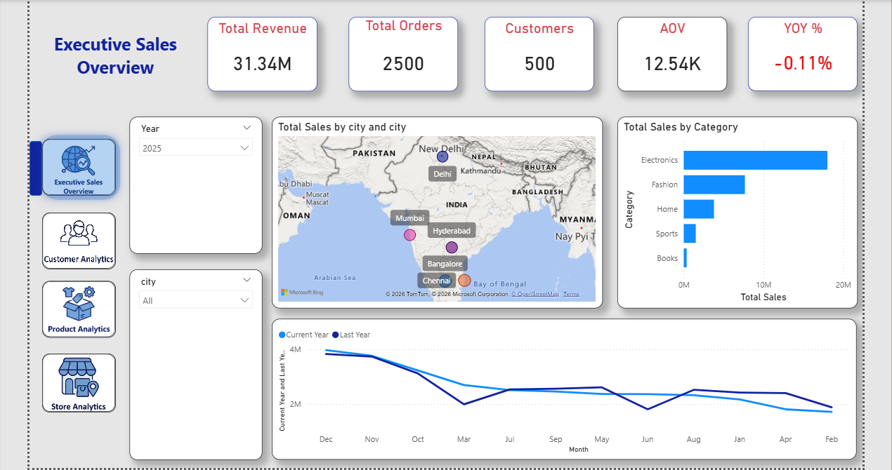
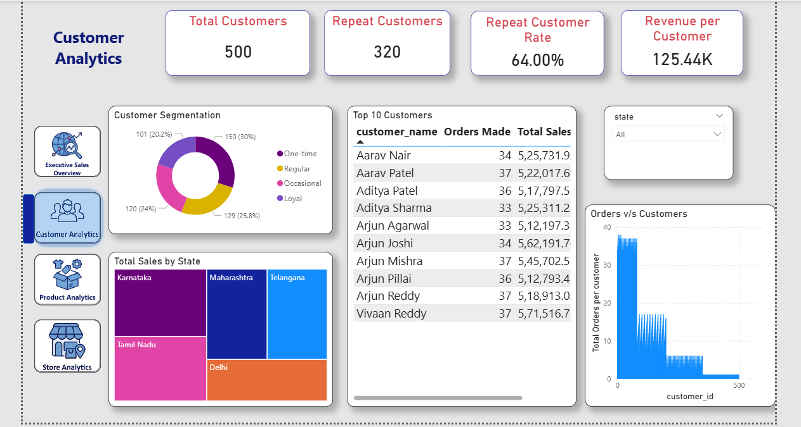
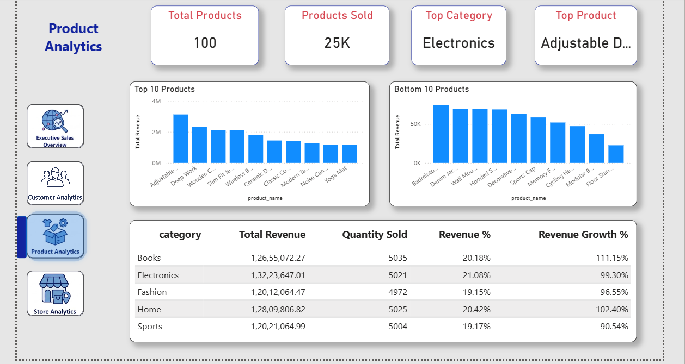
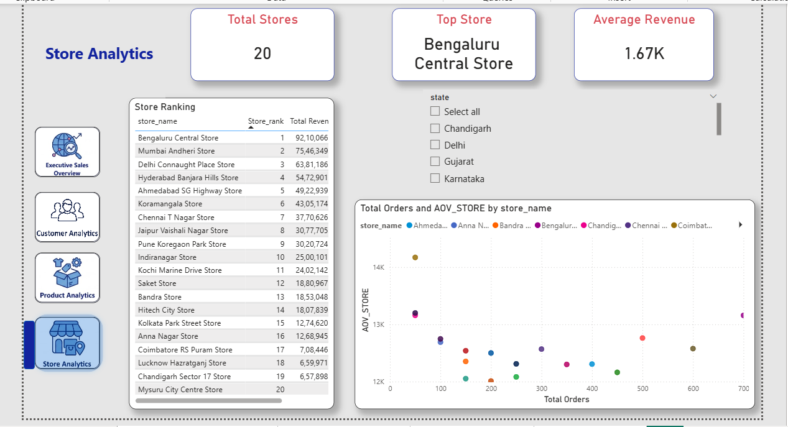

# Sales Analytics Dashboard | Power BI & MySQL

## Project Overview

This project is an end-to-end Sales Analytics solution built using **Power BI and MySQL**. The dashboard provides insights into sales performance, customer behavior, product performance, and store performance through interactive visualizations and KPIs.

The project analyzes:

- **500 Customers**
- **100 Products**
- **20 Stores**
- **2,500 Orders**

---

## Dashboard Pages

### 1. Executive Sales Overview

Provides a high-level overview of overall business performance.

**Key KPIs**
- Total Revenue
- Total Orders
- Total Customers
- Average Order Value (AOV)
- Year-over-Year Growth

**Visualizations**
- Sales by City
- Sales by Category
- Monthly Sales Trend
- Year Filter
- City Filter



---

### 2. Customer Analytics

Analyzes customer purchasing behavior and customer segments.

**Key KPIs**
- Total Customers
- Repeat Customers
- Repeat Customer Rate
- Revenue per Customer

**Visualizations**
- Customer Segmentation
- Top 10 Customers
- Total Sales by State
- Orders vs Customers
- State Filter



---

### 3. Product Analytics

Analyzes product and category-level performance.

**Key KPIs**
- Total Products
- Products Sold
- Top Category
- Top Product

**Visualizations**
- Top 10 Products by Revenue
- Bottom 10 Products by Revenue
- Category Revenue Analysis
- Quantity Sold
- Revenue Contribution
- Revenue Growth



---

### 4. Store Analytics

Analyzes store-level performance and revenue distribution.

**Key KPIs**
- Total Stores
- Top Store
- Average Revenue

**Visualizations**
- Store Ranking
- Store Performance
- Total Orders vs Average Order Value
- State Filter



---

## Key Features

- Interactive multi-page Power BI dashboard
- MySQL database integration
- SQL-based data analysis
- Data modeling across multiple related tables
- DAX measures and calculated metrics
- Customer segmentation
- Repeat customer analysis
- Product and category performance analysis
- Store ranking and performance analysis
- Year-over-Year sales comparison
- Interactive slicers and filters

---

## Technologies Used

- Power BI
- MySQL
- SQL
- DAX
- Data Modeling
- Data Visualization

---

## Database Structure

The project uses related tables including:

- Customers
- Orders
- Order Items
- Products
- Stores
- Employees
- Payments
- Returns
- Suppliers
- Departments
- Calendar

---

## Key Metrics

### Total Sales

```DAX
Total Sales =
SUM('sql_interview_db orders'[total_amount])
```

### Total Orders

```DAX
Total Orders =
DISTINCTCOUNT('sql_interview_db orders'[order_id])
```

### Average Order Value

```DAX
AOV =
DIVIDE(
    [Total Sales],
    [Total Orders]
)
```

### Revenue per Customer

```DAX
Revenue per Customer =
DIVIDE(
    [Total Sales],
    [Total Customers]
)
```

---

## Key Insights

- Electronics is the top-performing category.
- Customer purchasing behavior varies across one-time, occasional, regular, and loyal customer segments.
- Order counts vary across customers, creating a more realistic customer distribution.
- Store performance differs across locations.
- Product revenue varies significantly between top-performing and lower-performing products.
- The dashboard enables comparison between current and previous year sales.

---

## Project Structure

```text
sales-analytics-powerbi-project
│
├── CustomerSalesAnalytics.pbix
├── README.md
│
├── images
│   ├── executive_sales_overview.png
│   ├── customer_analytics.png
│   ├── product_analytics.png
│   └── store_analytics.png
│
└── sql
    └── database_setup.sql
```

---

## How to Run the Project

1. Open MySQL and create/import the project database using `sales-analytics-powerbi-project/sql/database_setup.sql`.
2. Open `sales-analytics-powerbi-project/CustomerSalesAnalytics.pbix` in Power BI.
3. Update the MySQL data source credentials if required.
4. Refresh the dataset.
5. Use the dashboard navigation buttons and slicers to explore the analysis.

---

## Author

**Aayush Pandey**

Technical Consultant at Oracle  
SQL | Python | Power BI | Data Analytics
